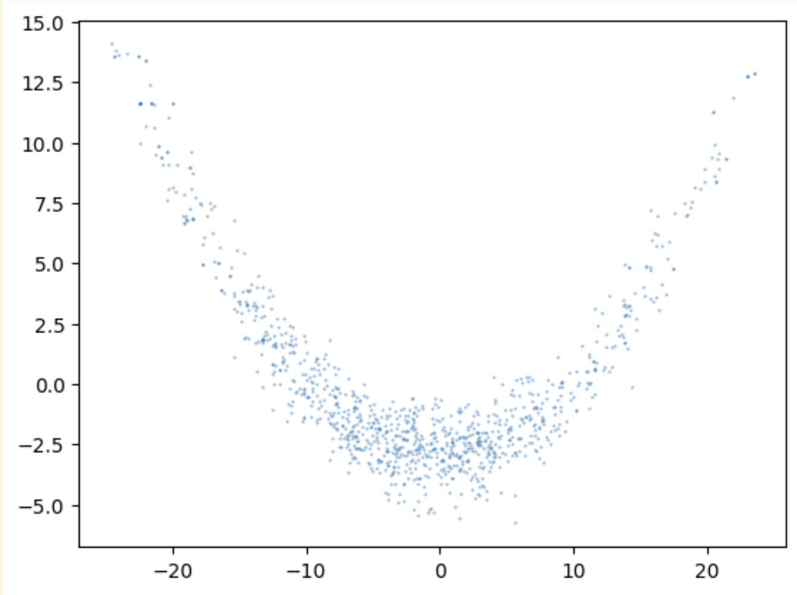

# Benchmarking Samplers

The purpose of this package is to run **[Blackjax sampling algorithms](https://blackjax-devs.github.io/blackjax/)** on models from **[Inference Gym](https://github.com/tensorflow/probability/blob/main/spinoffs/inference_gym/notebooks/inference_gym_tutorial.ipynb)**, and to collect statistics measuring effective sample size.

**It is currently under development**

# Usage

## Running a sampler on a model

```python
samples, metadata = samplers['nuts'](return_samples=True)(
        model=gym.targets.Banana(),
        num_steps=1000,
        initial_position=jnp.ones(2),
        key=jax.random.PRNGKey(0))
```

`samples` is then an array of samples from the distribution:



(See examples/demo.ipynb for the complete example with imports)

## Measuring Sampler Efficiency

This package provides `evaluate_sampler`, which can be used as follows:


```python
for i, (sampler, model) in enumerate(itertools.product(samplers, models)):

    err_t_mean_max, grads_to_low_max, err_t_mean_avg, grads_to_low_avg, _ = evaluate_sampler(
        sampler=samplers[sampler](),model=models[model], 
        num_steps=50000, 
        batch_size=32, key=key)

    # Append the results to the list
    results.append({
        'Sampler': sampler,
        'Model': model,
        'Grad evaluations to low error (avg)': grads_to_low_avg
    })

# Create the DataFrame
df = pd.DataFrame(results)
```


||Sampler                  |Model   |Grad evals to low error|
|------|-------------------------|--------|-----------------------------------|
|0     |nuts                     |Gaussian_10D|1419.2861                          |
|1     |nuts                     |Banana  |84265.58                           |
|2     |unadjusted_microcanonical|Gaussian_10D|266.0                              |
|3     |unadjusted_microcanonical|Banana  |5092.0                             |


(See examples/demo.py for the complete example, with imports)

Here, the statistic of interest is how many gradient calls it takes (of the log density of the model) to permanently decrease bias below $0.01$, where bias means $\frac{(E_{\mathit{sampler}}[x^2]-E[x^2])^2}{Var[x^2]}$, and $E_{\mathit{sampler}}$ is the empirical estimate of the expectation.

Since not all inference gym models have a known expectation $E[x^2]$, blackjax-benchmarks re-exports a subset which do (src/models).

<!-- Since gradient calls are the main computational expense of the sampler, and since $E[x^2]$ is a non-trivial statistic of a distribution, this metric is a good proxy for how long (in wallclock time) it takes a sampler to get good results on a given model.  -->

# Results

See [here](./results/grads_to_low_error.csv) folder for the results.

As the package is developed, the goal is to expand the set of models, samplers and statistics. **Anyone is welcome to contribute a new sampler, model or statistic!**

# Installation

Currently the package is not on PyPI, so you will need to clone the repository and install it locally.